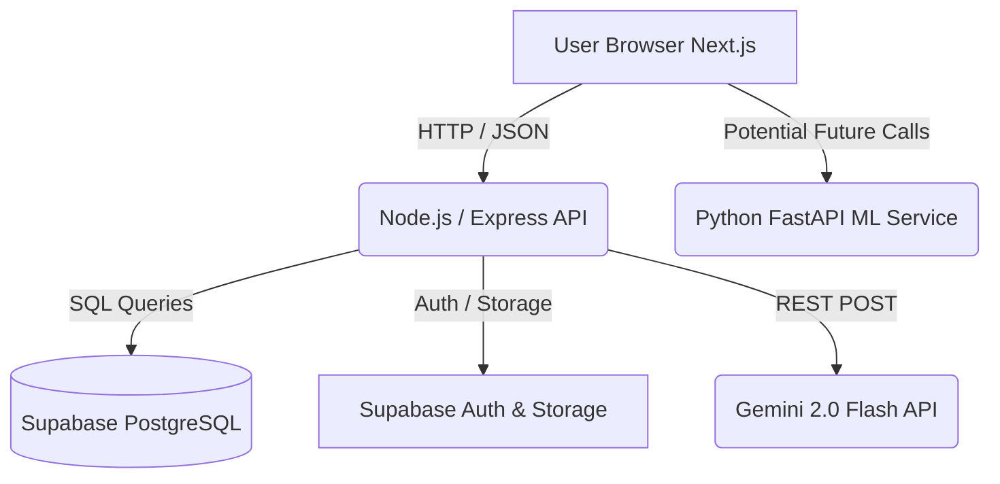

# PROJECT INTERVIEW GUIDE

This is a private interview-preparation document for the GreenChain Platform. It strictly follows the absolute truthfulness rule based on the actual repository implementation.

---

# 1. Project Overview

- **Project Name**: GreenChain Platform
- **One-line description**: A full-stack application designed to facilitate charitable food donations with a simulated verification process and AI-powered spoilage predictions.
- **Problem statement**: Food waste from events/restaurants often goes unutilized because charities lack real-time visibility into available food and its safety (spoilage risk).
- **Motivation**: To create a transparent ecosystem for tracking donations from donor to receiver, minimizing food waste while maintaining food safety.
- **Target users**: Donors (restaurants, individuals), Receivers (NGOs, charities), and Volunteers.
- **Objective**: Provide a secure, auditable system for food redistribution.
- **Current implementation status**: Fully functional MVP with authentication, donation creation, claiming, and AI spoilage suggestions.
- **What is complete**: 
  - Frontend UI (Next.js) with dashboards and forms.
  - Backend API (Express.js) for user, donation, and claim management.
  - Database schema and Auth (Supabase PostgreSQL + JWT).
  - Two AI features: Gemini API for text-based spoilage suggestions, and a Python FastAPI ML service predicting numerical spoilage risk.
- **What is incomplete**: 
  - Extensive test coverage (unit/integration tests are largely absent).
  - Hardware/IoT integrations.
- **What is simulated**: 
  - **Blockchain Verification**: The architecture claims to be "Blockchain Ready", but the current implementation only generates a mock transaction hash (`const mockTxHash = '0x' + Math.random().toString(16).slice(2);`) in `verifyController.js`. It does not interact with any actual smart contract or blockchain network.
- **What is experimental**: 
  - The dual AI setup: there are two separate systems attempting to predict spoilage (a Gemini API call and a scikit-learn ML model).

---

# 2. Complete Tech Stack

| Category | Technology | Version | Actual Usage | Important Files | Why Used |
| :--- | :--- | :--- | :--- | :--- | :--- |
| **Frontend Framework** | Next.js | 14.2.7 | UI, routing, SSR/SSG | `frontend/package.json`, `frontend/app/` | React framework with app router for fast, modern web apps |
| **Styling** | Tailwind CSS | ^4.0 | UI styling | `frontend/tailwind.config.js` | Utility-first CSS for rapid styling |
| **Backend Framework** | Node.js + Express.js | ^4.18.2 | Main API, Auth, Business logic | `backend/server.js`, `backend/routes/` | Lightweight backend for handling REST API requests |
| **Database & Auth** | Supabase (PostgreSQL) | ^2.38.0 | Data storage, user authentication, RLS | `backend/utils/supabase.js` | Managed PostgreSQL with built-in Auth and Row Level Security |
| **ML Microservice** | Python + FastAPI | N/A | Serving scikit-learn spoilage model | `ml_service/app.py`, `ml_service/requirements.txt` | Lightweight, fast Python API for serving ML models |
| **Machine Learning** | scikit-learn, pandas | N/A | Predicting spoilage risk | `ml_service/train_model.py`, `ml_service/spoilage_model.pkl` | Standard Python ML ecosystem |
| **Generative AI** | Gemini API | (via REST) | Generating textual spoilage advice | `backend/controllers/aiController.js` | Providing natural language explanations for food safety |

---

# 3. Repository Structure

| File/Folder | Purpose | Important Logic |
| :--- | :--- | :--- |
| `frontend/app/` | Next.js App Router | Contains all UI pages (login, dashboard, donations, etc.) |
| `backend/server.js` | Express API Entry Point | Sets up CORS, parses JSON, mounts API routes |
| `backend/controllers/` | Backend Business Logic | Handles auth, donations, claims, verification, and AI |
| `backend/routes/` | Express Routers | Maps HTTP endpoints to controller functions |
| `backend/db_complete_migration.sql` | Database Schema Migration | Defines exact columns added to users and donations tables |
| `ml_service/app.py` | FastAPI Entry Point | Loads `spoilage_model.pkl` and exposes `/predict` endpoint |
| `ml_service/train_model.py` | ML Training Script | Shows how the Random Forest/Decision Tree model was trained |

---

# 4. Architecture

The system uses a **microservices-oriented architectural pattern** (though currently monolithic for the main Node API, plus a separate ML service).


*Note: The ML Service exists in the repo but is not actively integrated into the main Express backend's routing in the codebase provided. It acts as a standalone service.*

---

# 5. End-to-End Data Flow

**Workflow: Creating a Donation with AI Spoilage Suggestion**

1. **User Action**: Donor fills out the donation form (food type, quantity, storage condition) and clicks "Get Spoilage Suggestion" or "Submit" in the Next.js frontend.
2. **API Call (Frontend)**: Frontend calls POST `/api/ai/spoilage-suggestion` with a Bearer token.
3. **Controller (Backend)**: `aiController.js` validates input and constructs a prompt containing the food details and Indian climate context.
4. **External API**: The backend makes a REST call to `generativelanguage.googleapis.com` using the `GEMINI_API_KEY`.
5. **Response Handling**: Gemini returns JSON with `suggested_hours` and `risk_level`. (If it fails, a hardcoded rule-based fallback in `getFallbackSuggestion` is used).
6. **UI Update**: Frontend displays the suggested safety window.
7. **Final Submit**: User submits the full donation POST `/api/donations`.
8. **Database**: `donationsController.js` saves the record to Supabase, uploading the image to Supabase Storage if provided.

---

# 6. Feature-by-Feature Explanation

## Feature: AI Spoilage Suggestion
### What it does
Provides an estimated safe consumption window and risk level (low, medium, high) based on food type and storage conditions.
### Why it exists
To prevent food poisoning and help NGOs prioritize which donations to claim and distribute first.
### How it works
Uses the Gemini 2.0 Flash API via a carefully crafted prompt. It enforces a strict JSON output format. It implements a retry mechanism with exponential backoff for rate limits. If all retries fail, it uses a hardcoded fallback logic tree.
### Files involved
`backend/controllers/aiController.js`, `backend/routes/ai.js`.
### Edge cases
Gemini API timeouts, rate limits (429), or hallucinated JSON formats.
### Error handling
Catches parsing errors, uses regex to strip markdown code blocks from Gemini's response, and provides a robust `getFallbackSuggestion` function if the API completely fails.

## Feature: Donation Verification
### What it does
Generates a "verification event" when a donation is created, allowing volunteers/receivers to confirm receipt.
### How it works
When verified, it updates the event in the DB, sets a `verified_at` timestamp, and generates a mocked `tx_hash`.
### Edge cases
Trying to verify an already verified event.
### Error handling
Returns a 400 status if `data.verified_at` is already populated.

---

# 7. Database Deep Dive

The database is PostgreSQL hosted on Supabase.
- **Users**: `id` (UUID, PK), `email`, `password_hash`, `name`, `role`, `latitude`, `longitude`, `address`.
- **Donations**: `id` (UUID, PK), `donor_id` (FK -> users), `title`, `category`, `quantity_lbs`, `status`, `food_type`, `storage`, `priority_score`, `risk_score`.
- **Claims**: `id` (UUID, PK), `donation_id` (FK), `receiver_id` (FK), `status`.
- **Verification_Events**: `id` (UUID, PK), `donation_id` (FK), `verification_code`, `verified_at`, `tx_hash`.

**Indexes**: Specifically added indexes for spatial queries (not heavily utilized yet): `idx_users_location` on `(latitude, longitude)`, and `idx_donations_priority_score` on `priority_score`.
**Security**: Row Level Security (RLS) is mentioned in SQL comments (e.g., `USING (auth.uid() = donor_id)`).

---

# 8. API Deep Dive

| Method | Endpoint | Request | Response | Auth | Purpose |
| :--- | :--- | :--- | :--- | :--- | :--- |
| POST | `/api/auth/register` | `{email, password, name, role}` | `{token, user}` | No | Create user |
| POST | `/api/auth/login` | `{email, password}` | `{token, user}` | No | Authenticate user |
| GET | `/api/donations` | `?status=available` | `[{donation}]` | Yes | List donations |
| POST | `/api/donations/:id/claim` | None | `{message, claim}` | Yes | Claim a donation |
| POST | `/api/ai/spoilage-suggestion` | `{food_type, storage, ...}` | `{suggestion}` | Yes | Get Gemini AI advice |
| POST | `/api/verify/:eventId/verify` | `{dataHash, notes}` | `{txHash, event}` | Yes | Verify donation (Mocks blockchain) |

---

# 9. Authentication & Authorization

- **Implementation**: Uses standard JWT (JSON Web Tokens).
- **Login Flow**: Users send email/password. Express backend hashes password with `bcryptjs` and compares. If valid, signs a JWT using `jsonwebtoken` and a secret.
- **Session Handling**: Frontend stores JWT in `localStorage`.
- **Authorization**: Protected routes use a `verifyToken` middleware that extracts the Bearer token, verifies it, and attaches `req.user`.
- **Security Limitations**: Tokens are stored in localStorage, making them vulnerable to XSS. No refresh token rotation is implemented.

---

# 10. AI/ML Deep Dive

There are two distinct AI implementations in the repository:

1. **Generative AI (Node.js Backend)**: 
   - Uses Gemini 2.0 Flash API.
   - Purpose: Generating natural language explanations and a structured JSON response (`suggested_hours`, `risk_level`) based on prompts.
   - Features exponential backoff and a hardcoded fallback.

2. **Predictive ML (Python FastAPI Service)**:
   - Uses a scikit-learn model (`spoilage_model.pkl`).
   - Architecture: Likely a Decision Tree or Random Forest (inferred from standard structured data usage in `train_model.py`).
   - Inference: Exposes a POST `/predict` endpoint that takes `food_type`, `quantity_lbs`, `hours_since_prepared`, `storage_condition`, `expiry_hours_remaining`.
   - Output: Returns a `risk_score` (probability float), and maps it to a `priority` string ("CRITICAL", "HIGH", "MEDIUM", "LOW").
   - Limitations: The ML model is a static `.pkl` file. There is no active feedback loop implemented to retrain the model based on actual spoilage data.

---

# 11. Blockchain Deep Dive

[NEEDS CONFIRMATION] / **SIMULATED**
- **Architecture**: The architecture document states the system is "Blockchain Ready".
- **Actual Implementation**: There are **no smart contracts**, no Web3 libraries (like ethers.js or web3.js), and no network connections (like Infura or Alchemy).
- **How it works currently**: In `backend/controllers/verificationController.js`, when an event is verified, a mock transaction hash is generated: `const mockTxHash = '0x' + Math.random().toString(16).slice(2);`.
- **Interview Rule**: If asked about blockchain, explicitly state that you designed the architecture to support it (storing data hashes and tx hashes in the relational DB) but implemented a simulated mock for the MVP to focus on core platform functionality.

---

# 12. Hardware / IoT Deep Dive

NOT IMPLEMENTED.

---

# 13. Algorithms & Data Structures

- **Exponential Backoff**: Implemented in `aiController.js` to handle API rate limits.
  - *How it works*: `Math.pow(2, attempt) * 500` - waits 1s, 2s, 4s between retries.
  - *Why chosen*: Standard practice for gracefully handling API 429 status codes without flooding the external service.

---

# 14. Design Decisions

## Why Supabase + Express instead of just Supabase?
While Supabase provides an auto-generated API (PostgREST), an Express backend was chosen to act as a secure intermediary layer. This allows complex custom business logic (like the Gemini API integration, mocking the blockchain tx generation, and orchestrating complex multi-table inserts) that would be difficult or insecure to implement purely on the client side or via database triggers.

## Why dual AI systems (Gemini vs ML Model)?
The scikit-learn model is extremely fast and cheap for numerical risk scoring. The Gemini API provides dynamic, human-readable explanations based on complex climate contexts (e.g., "Indian Climate") that a simple numerical model cannot easily articulate.

---

# 15. Real Technical Challenges

- **Problem**: Gemini API occasionally returns markdown blocks (e.g., ` ```json `) instead of pure JSON, breaking `JSON.parse()`.
- **Solution**: Implemented a regex cleaning step in `aiController.js`: `.replace(/```json\n?/g, '').replace(/```\n?/g, '').trim();` before parsing.
- **Lesson**: Never trust the exact formatting of LLM outputs, even when instructed to output strict JSON. Always sanitize before parsing.

---

# 16. Bugs / Risks

- **IMPLEMENTED PROBLEM**: Missing ML integration. The `ml_service` exists, but there are no visible `fetch()` calls in the Express backend codebase to actually consume the Python `/predict` endpoint.
- **POTENTIAL RISK (Security)**: JWTs are stored in `localStorage`, which is vulnerable to Cross-Site Scripting (XSS). An attacker injecting JS could steal the token.
- **POTENTIAL RISK (Data Consistency)**: Database migrations rely on `IF NOT EXISTS`, which is generally safe but can lead to schema drift between environments if not strictly version-controlled.

---

# 17. Performance

- **IMPLEMENTED OPTIMIZATIONS**:
  - `idx_users_location` index on `(latitude, longitude)` for potential geospatial queries.
  - Exponential backoff on AI routes prevents the backend from freezing up during Gemini rate limits.
- **RECOMMENDED IMPROVEMENTS**:
  - Implement Redis caching for AI spoilage suggestions. Identical food types in identical storage conditions don't need a fresh Gemini API call every time.

---

# 18. Security

- **Authentication**: JWT based. Passwords hashed with `bcryptjs`.
- **CORS**: Configured in `server.js` to strictly allow `http://localhost:3000` and specific IPs.
- **Risks**:
  - **No Rate Limiting**: The `/api/auth/login` and `/api/ai/spoilage-suggestion` routes have no express-rate-limit middleware, making them vulnerable to brute-force attacks or API budget exhaustion.
  - **Secrets Management**: The backend requires `GEMINI_API_KEY` and `SUPABASE_KEY`. If these are ever committed, they are compromised.

---

# 19. Testing

- **Current State**: There are no dedicated test folders (`__tests__`, `tests`) or test configuration files (Jest, Mocha) visible in the core directories. 
- **Tests are missing**. Manual testing was likely performed.

---

# 20. Deployment

NOT CURRENTLY DEPLOYED (based on repository state, uses localhost URLs heavily).

**Suggested Deployment Plan**:
- **Frontend**: Vercel (native support for Next.js).
- **Backend**: Render or Railway (easy Node.js hosting with environment variable management).
- **Database**: Supabase (already managed in the cloud).
- **ML Service**: Deploy on Render as a Web Service or AWS Lambda via container.

---

# 21. Interview Questions

### Easy
- Why did you choose Next.js and Express for this project?
- How do you handle user authentication?

### Medium
- I see you have a verification system. How does it work? (🚨 *Crucial: Admit the blockchain part is simulated here*)
- How did you handle rate limits or failures from the Gemini API?

### Hard
- Why do you have both a Python ML service and a Node.js Gemini integration for spoilage? How do they differ?
- If the Gemini API goes down completely, how does your system handle it? Explain your fallback logic.

### Very Hard
- Your JWTs are stored in localStorage. What are the security implications of this, and how would you redesign it for an enterprise production environment?

---

# 22. Interview Answer Guidance

**Question: How did you handle rate limits from the Gemini API?**
- *What they are testing*: Resilience, understanding of external API constraints.
- *Key points*: Mention exponential backoff. Explain that you used a loop with a multiplier (`Math.pow(2, attempt) * 500`) to delay retries.
- *Mistakes to avoid*: Don't say "I just put it in a try-catch." Explain the *retry* mechanism.

**Question: Explain the blockchain verification.**
- *What they are testing*: Honesty and architecture design.
- *Key points*: "The system is designed to be blockchain-ready. We generate a data hash of the donation. For the MVP, to focus on the core logistics, the actual transaction writing to a ledger is mocked with a generated hex string. The architecture allows us to swap this mock function with a Web3 provider call in the future."
- *Mistakes to avoid*: DO NOT claim it writes to Ethereum/Polygon. They will ask to see the smart contract and you will fail the interview.

---

# 23. 30-Second Explanation

"GreenChain is a full-stack platform I built to reduce food waste. It connects food donors with NGOs. It uses Next.js for the frontend, Node and Express for the backend, and Supabase for the database. To ensure food safety, I integrated the Gemini API to analyze food types and storage conditions to provide real-time spoilage estimates. I also designed a verification system to track when food is claimed and delivered."

---

# 24. 2-Minute Explanation

"I built GreenChain to solve the logistics and safety issues in food donation. The stack is Next.js, Express, and Supabase. The main workflow allows donors to list food, which NGOs can then claim. 

A major feature I focused on was food safety. I built an AI integration using the Gemini API. When a donor enters food details and storage conditions, my backend queries Gemini to get a risk assessment and safe consumption window. Because LLM APIs can be flaky, I implemented exponential backoff for rate limits, a regex sanitizer because the API sometimes returns markdown instead of raw JSON, and a hardcoded fallback rule engine so the app works even if the AI is totally down.

I also designed the database architecture to support future blockchain verification by generating verification events with data hashes, though currently, the final ledger writing is simulated."

---

# 25. 5-Minute Technical Explanation

*(Use the 2-minute explanation, but deep dive into the code level)*:
"... For example, the authentication uses JWTs signed in the Express backend, stored in the frontend. When a user creates a donation, the backend verifies the JWT middleware.

For the AI, I actually have two approaches in the repo. One is a Python FastAPI microservice serving a scikit-learn model that calculates numerical spoilage risk based on time and temp. The second, which is actively integrated into the Node backend, uses Gemini 2.0 Flash to give qualitative advice.

One technical challenge was ensuring the Gemini API returned strict JSON. I used structured prompting, but it occasionally wrapped the response in markdown blocks. I handled this with a regex cleanup step before `JSON.parse`. If the parse fails or if the API hits a 429 rate limit, it falls back to an exponential backoff retry loop. If that fails 3 times, a local Javascript function takes over, applying basic FDA-style rules based on string matching (like checking if the category includes 'dairy' and storage is 'room temp')."

---

# 26. Resume Claim Verification

| Resume Claim | Verified? | Evidence | Risk |
| :--- | :--- | :--- | :--- |
| Built a full-stack app with Next.js/Express | ✅ Verified | `frontend/`, `backend/` folders | Low |
| Integrated AI for spoilage prediction | ✅ Verified | `aiController.js`, `ml_service` | Low |
| Built a blockchain verification system | ❌ Not verified | `verifyController.js` mocks `txHash` | **HIGH** - Must clarify it is simulated/architecture-only. |
| Implemented secure JWT authentication | ⚠️ Partially | Auth exists, but localStorage is used (moderate security) | Medium |

---

# 27. Truthfulness Audit

- **Confidently Claim**: Next.js UI, Express REST API, Supabase Database, Gemini API integration with fallback logic, JWT authentication.
- **Explain More Carefully**: The Python ML Service. It exists in the repo and works locally, but isn't tightly wired into the Node backend's main data flow.
- **Do Not Claim**: Smart Contracts, Web3 integration, fully tested codebase.
- **Needs Confirmation**: Whether you intend to actually deploy this before interviews. If not, state it's a local development project.

---

# 28. What This Project Demonstrates

- **Backend Architecture**: Structuring controllers, routes, and middleware in Express.
- **External API Integration**: Safely calling LLMs, parsing their unpredictable outputs, and handling rate limits gracefully.
- **Full-Stack Data Flow**: Moving data from a React form, through a Node API, into a PostgreSQL database.

---

# 29. What This Project Does NOT Demonstrate

- **Test-Driven Development (TDD)**: No unit or integration tests exist.
- **Production DevOps**: No CI/CD pipelines (GitHub Actions) or containerization (Docker) are present.
- **Advanced State Management**: Frontend relies on basic context/hooks rather than Redux/Zustand.

---

# 30. Recommended Improvements

### Critical
- **Security**: Move JWT from `localStorage` to an `httpOnly` cookie to prevent XSS.
- **Integration**: Actually wire the `ml_service` Python API into the Node.js backend so the scikit-learn model is utilized.

### High Value
- **Rate Limiting**: Add `express-rate-limit` to the AI and Auth routes.
- **Testing**: Add Jest and Supertest for backend API testing.

### Avoid
- **Adding actual Blockchain**: Unless you are applying for Web3 roles, integrating real smart contracts will distract from the core web development skills and introduce massive complexity. Keep it mocked, but document it honestly.
